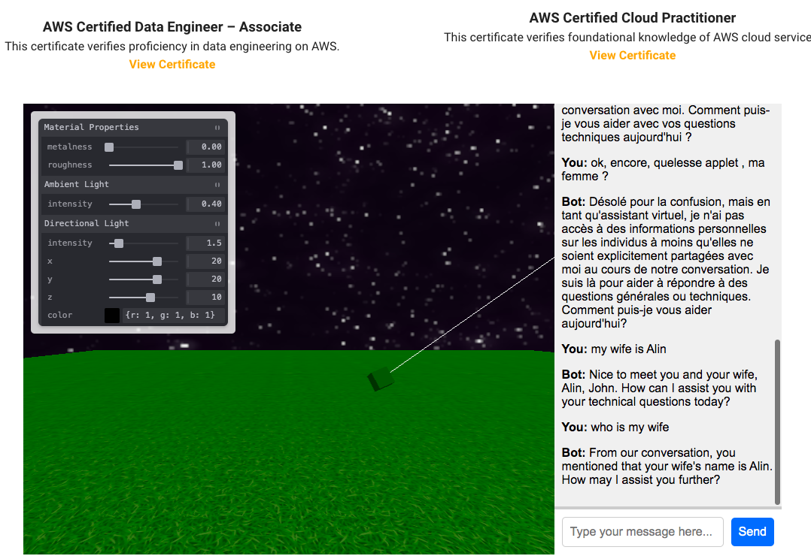
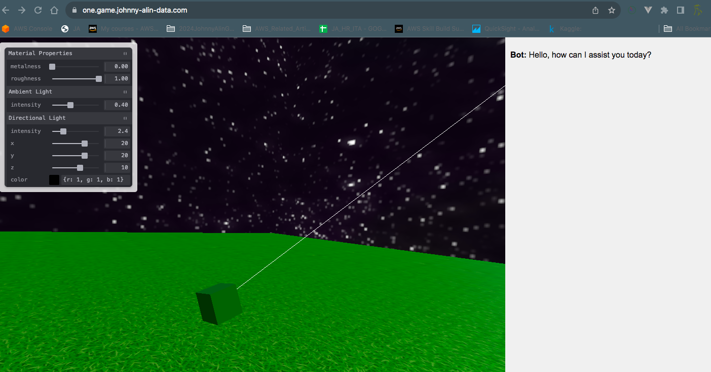
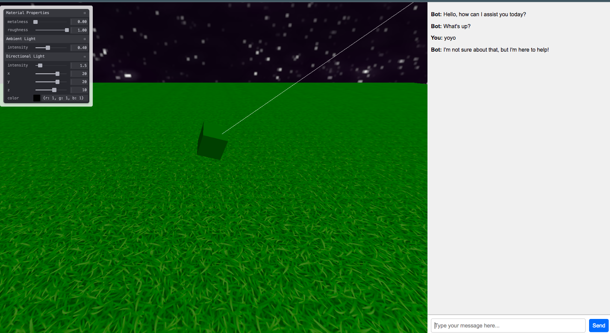
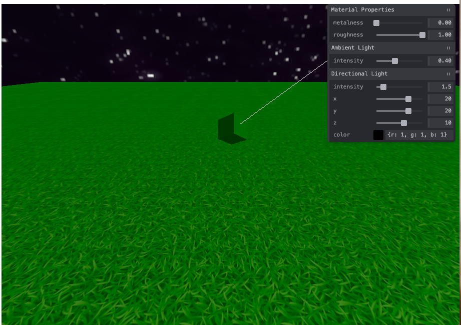

## Auto Run

- about auto run
  - edit /etc/systemd/system/vite.service
  - sudo systemctl daemon-reload
  - sudo systemctl enable vite
  - sudo systemctl start vite
  - sudo systemctl status vite


## 2024-10-19, embeded with open-ai-token

- Added integration with OpenAI API to generate chatbot responses in the right-side prompt.
- Implemented logic to load OpenAI API key from environment variables using `import.meta.env.VITE_OPENAI_API_KEY`.
- Replaced mock response function with actual API call to OpenAI's GPT-4 model for realistic chatbot responses.
- Introduced conversation buffer (FIFO) to maintain short-term memory for contextual conversations (set to 5 pairs).
- Added logic to ensure buffer size remains within limits, allowing coherent follow-up responses without exceeding token constraints.
- Tested successful communication with the OpenAI API, verified responses, and fine-tuned message handling logic.




---


## Domain View (success )



## 2024-10-16 , handle one.game.johnny-.com
- use http run npx vite
- use nginx to load .pem
- use nginx redirect http(vite)





## `ja_threejs_game` Repository Summary


### Key Features Implemented
- **Initial Scene Setup**:
  - Set up the basic Three.js environment, including a cube, grass plane, and skybox.
  - Added multiple light sources (ambient, point, and directional lights) to improve scene lighting.

- **Splitting the Interface**:
  - Split the user interface into two panels: 
    - **Left Panel**: Displays the 3D scene rendered with Three.js.
    - **Right Panel**: Chat interface to interact with the agents.
  - Adjusted the HTML and CSS to use 70% of the width for the Three.js scene and 30% for the chat and control panel.

- **Interactive Elements**:
  - Added interactive functionality, where clicking on the cube triggers a bot response in the right panel.
  - Created an input form for typing messages, with a "Send" button to simulate interaction with the agent.

- **Refactored Code**:
  - Separated the environment (`environment.js`) and panel (`panel.js`) into distinct modules for better code organization.
  - Modified the `main.js` to focus on the orchestration of these separate components.

- **Responsive Adjustments**:
  - Updated `main.js` to auto-adjust the renderer size to half the inner width (for the left panel), ensuring it resizes when the window size changes.

- **gRPC Backend Design**:
  - Created a plan for integrating a gRPC server to handle OpenAI LLM API calls.
  - Designed a `.proto` schema to facilitate agent-based LLM requests, considering scalability and multi-agent communication.

### Pending Features
- **LLM Integration**:
  - Plan to use gRPC with OpenAI API for interactive and dynamic responses from agents.
  - Future expansion to include backup Go service with gRPC for better scalability and resilience.

### Summary of Files Updated
- **`index.html`**: Updated to split the window for the left panel (Three.js scene) and right panel (chat).
- **`main.js`**: Handles orchestration, managing the environment and chat functionality, with resizing logic for responsive adjustments.
- **`environment.js`**: Contains all Three.js scene setup details (lighting, grass, cube, etc.).
- **`panel.js`**: Manages Tweakpane controls for lights, material properties, and more.

### Future Plans
- Integrate gRPC service with OpenAI API for better multi-agent interaction.
- Develop a backup Go service using gRPC to handle OpenAI API requests reliably.
- Expand agent features to handle complex contextual responses and maintain long-term conversation memories.


## 2024-10-13

Sure thing! Here’s a summary of today’s progress:

- Modularized `main.js` by moving environment and panel setup into separate files (`environment.js` and `panel.js`) to keep the main script clean.
- Implemented functionality to detect and respond to mouse clicks on the cube, including spawning a new cube that says "Hello".
- Added responsive behavior to adjust scene size and camera perspective dynamically when the window is resized.
- Enhanced the user experience with better camera control, including rotation and movement using WASD keys.

Let’s pick up where we left off tomorrow! 😊





---

Here’s a markdown-styled note with bullet points summarizing the steps to set up the environment, run the Three.js Hello World project on AWS, and set up Git:

### Project Setup Notes

#### **Project: Three.js Hello World with AWS and Git**

---

### **Steps to Create and Run Three.js on AWS:**

#### 1. **Create EC2 Instance on AWS**
   - Launch an EC2 instance using the following:
     - **Amazon Linux 2** as the OS.
     - Ensure **port 8888** is open in the security group for the Vite dev server.
     - Attach an **IAM role** (if needed for S3 or other services).
  
#### 2. **SSH into EC2 Instance**
   ```bash
   ssh -i /path/to/your-key.pem ec2-user@your-ec2-public-ip
   ```

#### 3. **Install Node.js and npm**
   - Update the instance and install **Node.js** along with **npm**:
     ```bash
     sudo yum update -y
     curl -fsSL https://rpm.nodesource.com/setup_16.x | sudo bash -
     sudo yum install -y nodejs
     ```
   - Verify installation:
     ```bash
     node -v
     npm -v
     ```

#### 4. **Create Project Directory**
   - Create a new directory for the project:
     ```bash
     mkdir ja_threejs_game
     cd ja_threejs_game
     ```

#### 5. **Initialize npm and Install Dependencies**
   - Initialize npm and install Vite and Three.js:
     ```bash
     npm init -y
     npm install vite --save-dev
     npm install three
     ```

#### 6. **Setup Project Files**
   - Create the necessary files:
     - `index.html`:
       ```html
       <!DOCTYPE html>
       <html lang="en">
       <head>
           <meta charset="UTF-8" />
           <meta name="viewport" content="width=device-width, initial-scale=1.0" />
           <title>Three.js Game</title>
       </head>
       <body>
           <script type="module" src="/src/main.js"></script>
       </body>
       </html>
       ```
     - `src/main.js`:
       ```javascript
       import * as THREE from 'three';

       const scene = new THREE.Scene();
       const camera = new THREE.PerspectiveCamera(75, window.innerWidth / window.innerHeight, 0.1, 1000);
       const renderer = new THREE.WebGLRenderer();
       renderer.setSize(window.innerWidth, window.innerHeight);
       document.body.appendChild(renderer.domElement);

       const geometry = new THREE.BoxGeometry();
       const material = new THREE.MeshBasicMaterial({ color: 0x00ff00 });
       const cube = new THREE.Mesh(geometry, material);
       scene.add(cube);

       camera.position.z = 5;

       function animate() {
           requestAnimationFrame(animate);
           cube.rotation.x += 0.01;
           cube.rotation.y += 0.01;
           renderer.render(scene, camera);
       }

       animate();
       ```

#### 7. **Vite Configuration**
   - Create the `vite.config.js` file to expose port 8888:
     ```javascript
     export default {
         server: {
             host: '0.0.0.0',
             port: 8888,
         },
     }
     ```

#### 8. **Run Vite**
   - Start the Vite development server:
     ```bash
     npx vite
     ```

   - Open the browser at `http://your-ec2-public-ip:8888` to view the running application.

---

### **Git Setup and Commit Steps:**

#### 1. **Initialize Git**
   - In your project directory, initialize Git:
     ```bash
     git init
     ```

#### 2. **Create .gitignore**
   - Create a `.gitignore` file to exclude unnecessary files (like `node_modules`):
     ```bash
     touch .gitignore
     nano .gitignore
     ```
   - Add the following content:
     ```plaintext
     node_modules/
     dist/
     *.log
     ```

#### 3. **Add Files to Git**
   - Stage the files for commit:
     ```bash
     git add .
     ```

#### 4. **Commit Changes**
   - Commit the changes:
     ```bash
     git commit -m "Initial commit with three.js setup"
     ```

#### 5. **Connect to GitHub**
   - Add the remote GitHub repository:
     ```bash
     git remote add origin git@github.com:your-username/ja_threejs_ai_game.git
     ```

#### 6. **Push to GitHub**
   - Push the code to GitHub:
     ```bash
     git push -u origin main
     ```

---

### **Done!** 🎉

Done set up and running on AWS, with the source code tracked and managed using GitHub.

---


---


---


## Git imbeded
- create git-hub
- in your local-aws: git init


----


## Intall
sudo yum update -y
curl -fsSL https://rpm.nodesource.com/setup_16.x | sudo bash -
sudo yum install -y nodejs


## verify
node -v
npm -v

## Install
npm install three


## Into folder
npm init -y
npm install vite --save-dev

## Edit
src/main.js (content)
vite.config.js (port setting)
index.html


